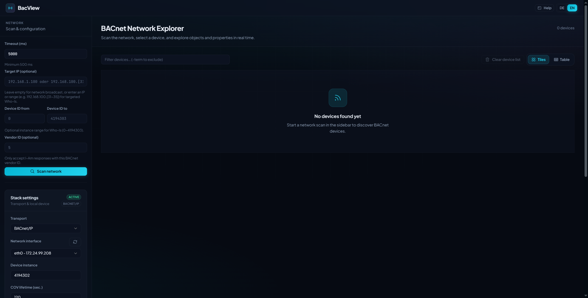

# BacView

BACnet explorer built in Elixir with Phoenix LiveView and [bacstack](https://github.com/bacnet-ex/bacstack).

Discover devices, browse Structured View hierarchies or create your own based upon object names,
read and write properties, subscribe to COV updates, and monitor alarms - all in real time from the browser.

This project has been built with Grok Build and the Composer 2.5 Fast model.



## Features

- **Network discovery** - Who-Is / I-Am scan with live device list, filters, and optional limited instance / vendor ranges
- **BBMD / Foreign Device** - register with a remote BBMD so Who-Is is distributed via Distribute-Broadcast-To-Network; automatic re-registration
- **Stack settings** - transport (BACnet/IP or MS/TP), network interface / serial port, local device instance, APDU/timeout options; persisted to `runtime_settings.json` and restartable from the UI
- **Device load & scan** - full device object list scan with progress banner; scan recovery for validation failures (relaxed value/type skip modes)
- **Hierarchies** - Structured View tree with search and “reveal in flat list”; optional **name-based hierarchy** built from object-name separators when no Structured View exists
- **Object explorer** - property table with RPM (ReadPropertyMultiple) first, individual ReadProperty fallback, live load progress, status-flag icons, and COV badges
- **Property writes** - Present_Value (with priority where applicable), generic property write, and weekly schedule editor
- **COV subscriptions** - per-property or bulk Present_Value subscribe, auto-renewal, active-subscription overview, notification log, and COV history charts (CSV/JSON export)
- **Alarms & events** - GetAlarmSummary polling, live Confirmed/UnconfirmedEventNotification handling, active-alarm popups, notification-class recipient enrollment, JSON/CSV event export
- **Trend logs** - chart viewer for log buffer data, time-range navigation, CSV/JSON export
- **File objects** - AtomicReadFile / AtomicWriteFile transfer UI
- **EDE export** - generate BACnet Engineering Data Exchange files from a scanned device (`bacnet_ede`)
- **Device services** - time synchronization, DeviceCommunicationControl, and ReinitializeDevice
- **i18n** - German (default) and English via Gettext; locale switcher persisted in `localStorage` (desktop: OS locale on first launch)
- **Keyboard shortcuts** - press `?` for help (`/`, `r`, `1`–`4`, `0` / Escape on device pages)

## Requirements

- Elixir ~> 1.18
- Erlang/OTP 26+
- Node.js (asset bundling in dev)
- UDP port **47808** available for BACnet/IP (others choosable)

## Quick start (development)

```bash
mix setup
mix phx.server
```

I recommend running `mix deps.update --all` before to get the newest versions and latest bacstack patches/improvements.

Open [http://localhost:4000](http://localhost:4000), click **Scan network**, then select a device.

To discover devices on a **remote BACnet/IP network**, register BacView as a Foreign Device with your BBMD (dashboard sidebar). Who-Is scans are then distributed through the BBMD.

**Stack settings** (transport, network interface, device instance, COV options, BBMD) are configured in the dashboard sidebar and persisted to `priv/runtime_settings.json`.

Copy `.env.example` to `.env` and adjust as needed (optional in dev).

## Desktop app -experimental- (optional)

BacView can also run as a native desktop app via [ElixirKit](https://hex.pm/packages/elixirkit) and [Tauri](https://v2.tauri.app/).

Desktop mode is selected at **compile time** with `BACVIEW_DESKTOP=1`. Run `mix clean` when switching between web and desktop builds.
The environment variable ensures that we only pull desktop dependencies when we need them and otherwise keep it clean.

**Requirements:** Some system packages are required for Tauri.

For recent Debian-based installations:
```bash
sudo apt update
sudo apt install libwebkit2gtk-4.1-dev \
  build-essential \
  curl \
  wget \
  file \
  libxdo-dev \
  libssl-dev \
  libayatana-appindicator3-dev \
  librsvg2-dev \
  inotify-tools
```

Starting the desktop application:

```bash
BACVIEW_DESKTOP=1 mix desktop.setup
BACVIEW_DESKTOP=1 mix desktop.server
```

or

```bash
./scripts/desktop_dev.sh
```

Windows also has a batch with ending `.bat`.

Package a distributable installer (`.{AppImage,deb,rpm}` on Linux, `.exe` on Windows):

```bash
BACVIEW_DESKTOP=1 mix desktop.installer
```

or

```bash
./scripts/desktop_release.sh
```

Windows also has a batch with ending `.bat`.

Desktop notes:

- Settings persist under `~/.config/bacview/runtime_settings.json`
- OS locale is detected on launch and applied; DE/EN can still be switched in the app
- MS/TP will be included if the dependency `circuits_uart` is present or non-Windows OS - typically it will be omitted on Windows (due to NIF)

Verify desktop dependencies: `BACVIEW_DESKTOP=1 mix bacview.desktop.check`

## Configuration

| Variable | Default | Description |
|----------|---------|-------------|
| `PHX_SERVER` | - | Set `true` to start HTTP in releases |
| `PORT` | `4000` | HTTP port |
| `SECRET_KEY_BASE` | - | Required in production (see `mix phx.gen.secret`) |
| `BACVIEW_BACSTACK_DEBUG` | - | Enable verbose bacstack debug logs (`1` / `true`) |
| `BACVIEW_ENABLE_MSTP` | - | Enable MS/TP transport regardless of platform (`1` / `true`) |
| `BACVIEW_DESKTOP` | - | Set to `1` at compile time to build the desktop app (see above) |
| `BACVIEW_DESKTOP_LOCALE` | - | The locale to use on startup (automatically set by the desktop app) |
| `BACVIEW_LOG_PATH` | `~/.config/bacview/bacview.log` on desktop, `tmp/bacview.log` otherwise | Location of the Logger logfile |
| `BACVIEW_PROPERTY_READ_CONCURRENCY` | `8` | Max parallel individual `ReadProperty` requests when loading object properties / scan fallback - lower (e.g. `1`) if old devices are overwhelmed |
| `BACVIEW_READ_CONCUR_ENABLE_SHARED_RED` | - | Cap property-read concurrency to 1 when multiple devices share a transport address (e.g. router) (`1` / `true`) |
| `BACVIEW_SETTINGS_PATH` | `priv/runtime_settings.json` | Optional override for persisted stack settings |
| `BACVIEW_TIMEZONE` | `Europe/Zurich` | IANA timezone for BACnet wall-clock timestamps, bacstack, and UI display |

## Production release

```bash
mix assets.deploy
SECRET_KEY_BASE=$(mix phx.gen.secret) mix release
```

Start the release:

```bash
PHX_SERVER=true PORT=4000 ./_build/bacview/rel/bacview/bin/server
```

Or use the release binary directly:

```bash
PHX_SERVER=true ./_build/bacview/rel/bacview/bin/bacview start
```

Place a `.env` file next to the release root to load environment variables at startup (see `rel/env.sh.eex`).

## Architecture

### Supervision tree

```
BacView.Application                          # strategy: :one_for_one
├── BacViewWeb.Telemetry
├── BacView.PubSub
├── BacView.Settings                         # runtime_settings.json
├── BacView.LogStore                         # in-app log ring buffer (+ optional file)
│
│  # when config :bacview, start_bacnet: true (default; tests set false):
├── BacView.BACnet.Cache                     # named ETS tables
├── BacView.BACnet.Stack                     # supervisor (see below)
├── BacView.BACnet.ForeignRegistration       # BBMD foreign device re-registration
├── BacView.BACnet.Discovery                 # Who-Is / I-Am
├── BacView.BACnet.SubscriptionManager       # COV subscribe / renew / notification log
├── BacView.BACnet.NotificationClassRecipient
├── BacView.BACnet.AlarmEvent                # GetAlarmSummary + event notifications
├── BacView.BACnet.NetworkNumber             # What-Is / Network-Number-Is (NPDU)
│
│  # always started (also when start_bacnet: false):
├── BacView.BACnet.DeviceRegistry            # Registry :unique → DeviceSession
├── BacView.BACnet.DeviceSessionSupervisor   # DynamicSupervisor → DeviceSession
│
├── BacViewWeb.Endpoint
└── # desktop only (BACVIEW_DESKTOP=1 compile):
    ├── ElixirKit.PubSub
    └── Task (broadcasts ready:http://… to the desktop shell)
```

**`BacView.BACnet.Stack`** (child supervisor):

```
Stack
├── Stack.Boot                               # GenServer: start/restart/monitor runtime
└── Stack.Runtime                            # started later via Boot.start_runtime/0
    ├── Transport.*                          # IPv4 or MS/TP (named TransportLayer)
    ├── Segmentator                          # bacstack segmentation
    ├── SegmentsStore
    └── Client                               # bacstack client (named ClientStack)
```

Notes:

- **BACnet domain processes** (Cache through NetworkNumber) start only when
  `config :bacview, start_bacnet: true`. Tests set `start_bacnet: false` to avoid UDP.
- **DeviceRegistry + DeviceSessionSupervisor** always start so session APIs stay available
  even with BACnet offline.
- The stack **Runtime** (transport + client) is **not** started inside `init/1`. After the
  root supervisor is up, `Application` calls `Stack.Boot.start_runtime/0`. Invalid settings
  leave the app running with BACnet offline; settings can be fixed and the stack restarted
  from the UI (`Stack.restart/0`).
- `Stack.Runtime` uses `:one_for_all` and is registered as a **temporary** child of `Stack`
  so a crash does not loop forever; Boot monitors it and exposes `status/last_error`.
- After the root supervisor starts, `LogStore.attach/0` installs a `:logger` handler for the in-app viewer.

### Layers

| Layer | Modules | Role |
|-------|---------|------|
| Settings / platform | `Settings`, `LogStore`, `Platform`, `Timezone` | Persisted stack config, log buffer, desktop vs web |
| Stack / transport | `Stack`, `Stack.Boot` / `Runtime`, `Transport.*`, `Client`, `TransportResolver` | bacstack client, IPv4/MS/TP, APDU segmentation |
| BBMD / foreign device | `ForeignRegistration` | Register with remote BBMD; TTL re-registration |
| Network layer | `NetworkNumber` | Local network number, What-Is-Network-Number / Network-Number-Is |
| Discovery | `Discovery`, `IAmCollector` | Who-Is / I-Am, device list + share ETS |
| Per-device session | `DeviceSession`, `DeviceSessionSupervisor`, `DeviceRegistry` | Load/scan device, object cache, property read/write, scan recovery |
| Property IO | `PropertyLoad`, `Protocol.PropertyReader` / `PropertyWriter`, `ObjectScanRead` | RPM first, individual ReadProperty fallback, writes, scan fallback |
| Validation recovery | `ValidationSkipStore` | Persist skip modes after scan recovery |
| Subscriptions / COV | `SubscriptionManager`, `Subscription` | COV subscribe, auto-renew, notification log |
| Alarms / events | `AlarmEvent`, `ActiveAlarms`, `NotificationClassRecipient` | Poll + live events, active lists, NC recipient enrollment |
| Hierarchy | `HierarchyBuilder`, `NameHierarchyBuilder`, `NameHierarchyCache`, `HierarchySplit` | Structured View + name-split trees |
| Device services / files | `DeviceServices`, `FileTransfer`, `EdeExport` | Time sync, DCC, reinit, AtomicRead/WriteFile, EDE |
| Protocol helpers | `Protocol.*` (formatters, charts, trend log, schedules, …) | Display, export, chart payloads |
| Web | `BacViewWeb.Live.*`, components, helpers | LiveViews, tables, popups, charts |

Primary UI routes:

| Path | LiveView |
|------|----------|
| `/` | `DashboardLive` |
| `/devices/:device_id` | `DeviceLive` |
| `/devices/:device_id/objects/:type/:instance` | `ObjectLive` |

Domain logic lives under `lib/bac_view/bacnet/`; UI under `lib/bac_view_web/`. Runtime BACnet state uses **ETS** (`BacView.BACnet.Cache` and a few owner-created tables) and JSON settings (`BacView.Settings`) - no Ecto for domain data.

### Device load vs object property load

**Full device scan** (`DeviceSession` load/reload): device object → object list → per-object scan → hierarchy. Progress on PubSub `"device:#{id}:load_progress"`.

**Single-object properties** (`DeviceSession.read_properties` → `PropertyLoad` → `PropertyReader`):

1. Prefer RPM (`read_object` / ReadPropertyMultiple with `read_level: :all`).
2. On segmentation/buffer-style failures → individual concurrent `ReadProperty` (default concurrency **8**, `BACVIEW_PROPERTY_READ_CONCURRENCY`).
3. Validation skip mode (from scan recovery) is applied via bacstack `object_opts` on the normal path - it does not force the scan path alone.
4. On certain hard failures → `ObjectScanRead` fallback (same individual-read style as step 2).

Individual property progress is broadcast on `"device:#{id}:properties_progress"` and shown in the object detail UI.

#### Heavy properties (RPM vs fallback)

Some properties are treated as **heavy**: large or expensive lists that can stall the UI for a long time if each element (or the whole list) is fetched with individual `ReadProperty` calls. The behaviour depends on the load path:

| Path | Heavy properties |
|------|------------------|
| **RPM success** (`read_object` / `:all`) | **Included** in the object property table. Values were already returned in the RPM response, so they are kept for display and debugging (e.g. `object_list`, bindings, COV subscription lists). |
| **Any individual / fallback path** | **Not read at all** — removed from the candidate list *before* `ReadProperty` is issued. They do not appear in the UI and are not requested from the device. |

This applies to:

- Object property view when RPM fails and BacView falls back to per-property reads
- Schema / `property_list` fallback when the device has no usable property list
- `ObjectScanRead` / scan-style map loads used during device scan and hard-error recovery

Examples of heavy identifiers (see `PropertyReader.heavy_properties_for/1` for the full list):

- **Device objects:** `object_list`, `structured_object_list`, `device_address_binding`, `active_cov_subscriptions`, slave/manual slave bindings, time-sync / restart notification recipient lists, `configuration_files`, and `property_list` itself
- **Trend Log / Trend Log Multiple:** `log_buffer` (and `property_list`)
- **All other object types:** `property_list` only (used only to discover which properties exist; not shown as a row)

**Practical effect:** if a device supports RPM well, open the Device object (or any object loaded via RPM) and heavy lists show up like any other property. If the device forces the individual path, those rows are simply missing — BacView is not hiding a value it already has; it never asked for them, so discovery and object loads stay usable on limited devices.

### ETS tables

Owned by `BacView.BACnet.Cache` at startup:

`:bacview_devices`, `:bacview_device_share`, `:bacview_objects`, `:bacview_properties`,
`:bacview_subscriptions`, `:bacview_hierarchy`, `:bacview_name_hierarchy`, `:bacview_events`,
`:bacview_validation_skip_modes`

Created by other processes (still cleared with device data via `Cache.clear_all_device_data/0`):

| Table | Owner |
|-------|--------|
| `:bacview_cov_notification_log` / `:bacview_cov_notification_seq` | `SubscriptionManager` |
| `:bacview_notification_log` / `:bacview_notification_seq` | `AlarmEvent` |
| `:bacview_nc_recipients` | `NotificationClassRecipient` |

Web code must not open subscription ETS directly - use `SubscriptionManager` APIs.

### Transports

| Module | Status |
|--------|--------|
| `BacView.BACnet.Transport.IPv4` | Production-ready (BACnet/IP UDP) |
| `BacView.BACnet.Transport.MSTP` | Available when `circuits_uart` / MS/TP stack is present; experimental |
| `BacView.BACnet.Transport.BACnetSC` | Stub for future BACnet/SC (WebSocket) |

Transport selection and network interface are configured in the dashboard sidebar (persisted settings).

## Tests

```bash
mix precommit   # unlock unused deps, compile -Werror, format, credo, dialyzer, test
```

BACnet is disabled in test (`config/test.exs`: `start_bacnet: false`) to avoid UDP port conflicts.

## License

See project license.
